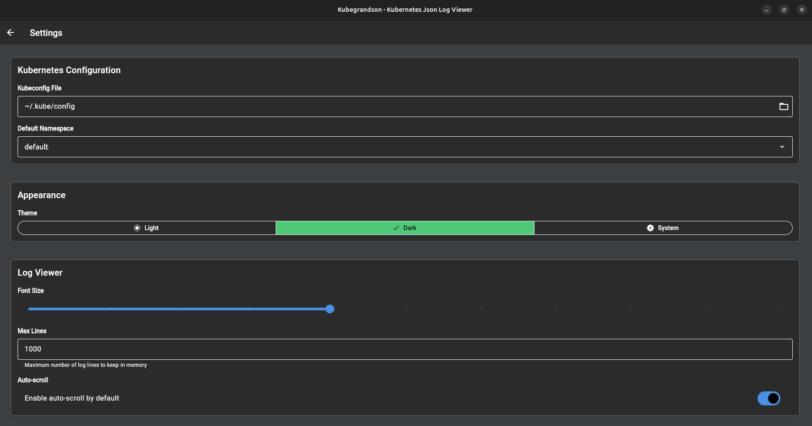
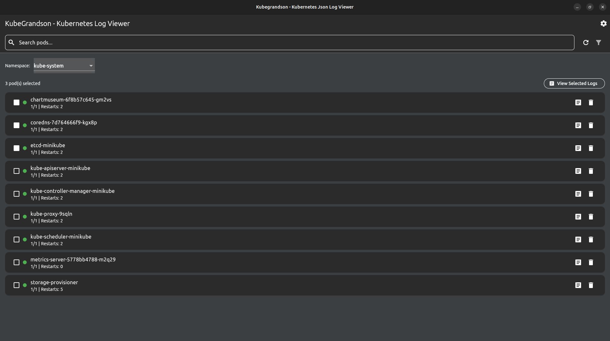
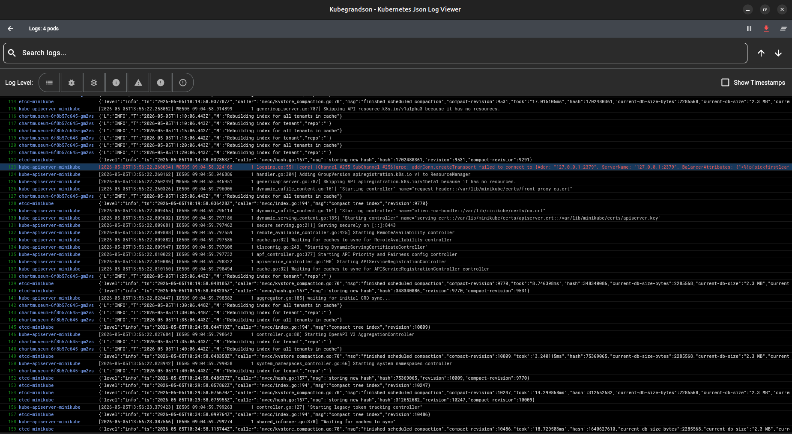

# Kubegrandson


**Kubegrandson** is a modern Flutter-based Kubernetes log viewer - the proud grandson of **Kubeson**! 🎉

Built with Flutter and Dart, Kubegrandson brings the powerful features of Kubeson to a cross-platform, modern UI framework while maintaining the same intuitive interface developers love.

## 🌟 Features

Kubegrandson inherits all the great features from its grandfather Kubeson:

- ✅ Select Kubernetes namespace
- ✅ Log level filters (TRACE, DEBUG, INFO, WARN, ERROR, FATAL)
- ✅ Multiple tabs to visualize multiple pods simultaneously
- ✅ Multiple pods in a single tab
- ✅ Search engine with text highlight
- ✅ Logs by APP Label (automatic log restart when pod restarts)
- ✅ Logs colored by log level
- ✅ JSON viewer with collapsible arrays and objects
- ✅ JSON viewer automatically collapses arrays with more than 4 elements
- ✅ Escaped JSON strings are automatically parsed and displayed as JSON
- ✅ Clear logs button
- ✅ Stop log feed button
- ✅ Stop log feed and continue in a new tab (for easy comparison)
- ✅ Big JSON fields are hidden (configurable threshold)
- ✅ Export all log lines
- ✅ Export searched log lines
- ✅ Drag and drop log files

## 🆕 New Features in Kubegrandson

- 🎨 Modern Material Design 3 UI
- 🖥️ Enhanced desktop experience
- ⚡ Improved performance with Flutter
- 🔄 Better state management
- 📱 Potential for mobile support in the future

## 📸 Screenshots

### Checking the default minikube configuration



### Selecting which pods you want to see the log



### Log reading four pods at the same time


## 🚀 Getting Started

### Prerequisites

- Flutter SDK 3.0 or higher
- Dart SDK 3.0 or higher
- Linux desktop build tools when running on Ubuntu/Debian:
  ```shell
  sudo apt update
  sudo apt install clang cmake ninja-build pkg-config libgtk-3-dev libstdc++-12-dev liblzma-dev mesa-utils libsecret-1-dev lld
  ```
- Access to a Kubernetes cluster (minikube, kind, or remote cluster)
- Valid kubeconfig file in `~/.kube/config`

### Installation

1. Clone the repository:
   ```shell
   git clone https://github.com/brunopenha/kubegrandson.git
   cd kubegrandson
   ```

2. Install Flutter dependencies:
   ```shell
   flutter pub get
   ```

3. Verify Linux desktop support is ready:
   ```shell
   flutter doctor -v
   ```

   If Flutter reports `CMake is required for Linux development`, install the Ubuntu packages listed in the prerequisites section and run `flutter doctor -v` again.

   If the Linux build fails inside `flutter_secure_storage_linux` with `json.hpp` errors like this:

   ```text
   error: identifier '_json' preceded by whitespace in a literal operator declaration is deprecated [-Werror,-Wdeprecated-literal-operator]
   ```

   refresh the Flutter dependencies so the project uses a Linux plugin version compatible with newer Clang/LLVM toolchains:

   ```shell
   flutter clean
   flutter pub get
   ```

   If the Linux build fails with a linker error like this:

   ```text
   ERROR: Target dart_build failed: Error: Failed to find any of [ld.lld, ld] in LocalDirectory: '/usr/lib/llvm-21/bin'
   ```

   install LLVM's linker package:

   ```shell
   sudo apt install lld
   ```

   On Ubuntu versions that package LLVM tools by major version, this can also be fixed with:

   ```shell
   sudo apt install lld-21
   ```

   If the build fails with a Snap path like this:

   ```text
   Failed to find any of [ld.lld, ld] in LocalDirectory: '/snap/flutter/.../usr/lib/llvm-10/bin'
   ```

   the Flutter Snap package is missing the linker inside its read-only toolchain directory. Installing `lld` with `apt` might not fix that because the failing lookup is inside `/snap/flutter/...`.

   Recommended fix: remove the Snap Flutter package and install Flutter from the official SDK/git distribution instead:

   ```shell
   sudo snap remove flutter
   mkdir -p ~/dev
   git clone https://github.com/flutter/flutter.git -b stable ~/dev/flutter
   echo 'export PATH="$HOME/dev/flutter/bin:$PATH"' >> ~/.bashrc
   source ~/.bashrc
   hash -r
   flutter doctor -v
   ```

   Confirm that Flutter and Dart no longer come from Snap:

   ```shell
   which flutter
   which dart
   ```

   Both commands should point to `~/dev/flutter/bin/...`, not `/snap/...`.

4. Run the app on Linux:
   ```shell
   flutter clean
   flutter pub get
   flutter run -d linux
   ```

## 🏗️ Generating Desktop Builds

Flutter desktop support must be enabled before producing release builds:

```shell
flutter config --enable-linux-desktop
flutter config --enable-windows-desktop
flutter doctor -v
```

### Linux

Install the Linux desktop dependencies listed in the prerequisites section, then run:

```shell
flutter clean
flutter pub get
flutter build linux --release
```

The release bundle is generated at:

```text
build/linux/x64/release/bundle/
```

### Windows

Windows builds must be generated on Windows. Install Flutter, Visual Studio with the "Desktop development with C++" workload, and then run:

```powershell
flutter clean
flutter pub get
flutter build windows --release
```

The release bundle is generated at:

```text
build\windows\x64\runner\Release\
```
