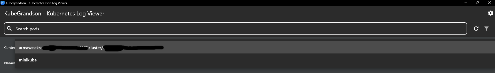
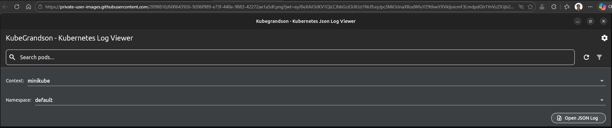

# Kubegrandson


Kubegrandson is a Flutter desktop app for Kubernetes troubleshooting and log analysis.

## Beta status

This is a beta version tested for:

- Ubuntu Linux (Debian-based)
- Windows 11 (also works on Windows 10 for installer flow)

## Main changes in this beta

### 1) Offline JSON log import

You can import an external JSON log file and inspect it offline.


### 2) Kubernetes context switch (minikube / AWS EKS)

You can switch Kubernetes context from the UI. For AWS EKS, local AWS access must already be available.



When using EKS, make sure the selected kubeconfig file points to the right `.kube/config`.



### 3) Add troubleshooting markers in the log

You can add log markers without clearing the current log stream.


### 4) Non-JSON log rendering

Logs that are not JSON are still supported and visualized correctly.


### 5) Deployment and ConfigMap inspection/editing

You can open and edit Deployment and ConfigMap data related to selected pods.


### 6) AWS auth flow improvements

- Dedicated AWS settings section for profile, region, cluster, account, and SSO metadata
- Explicit AWS unauthorized guidance in the UI
- Retry flow for expired EKS credentials

Legacy 401 view (before the updated guidance):

## Kubernetes and AWS configuration

In **Settings**, configure:

- `Kubeconfig File` (used by the app for initialization and context switching)
- AWS EKS fields (profile, region, cluster, account, SSO URL, SSO region)

Then click **SSO Login & Update kubeconfig** to run the AWS refresh flow from the app.

Security note:

- Do not store or share raw temporary AWS access key/secret/session token values in docs or screenshots.
- Use profile-based SSO where possible.

## Installation

### Ubuntu (Debian-based)

Install with package manager (UI):


Install from terminal:

```bash
sudo apt install kubegrandson_0.0.2_amd64.deb
```

Uninstall:

```bash
sudo apt remove kubegrandson
```

### Windows

Run `kubegrandson_setup.exe` to install on Windows 10/11.

Windows SmartScreen can show a warning for unsigned internal builds:

- Click `More info`
- Click `Run anyway`

Uninstall options:

1. Settings -> Apps -> Installed apps -> Kubegrandson -> Uninstall
2. Control Panel -> Programs -> Uninstall a program -> Kubegrandson
3. Start Menu -> Kubegrandson -> Uninstall Kubegrandson

During uninstall, if asked about user data:

| Choice | Result |
| --- | --- |
| No (default) | Removes binaries only, keeps user data under `%LOCALAPPDATA%` / `%APPDATA%` |
| Yes | Removes binaries and user data folders |

## Development

```bash
flutter pub get
flutter run -d windows
```

or

```bash
flutter run -d linux
```
