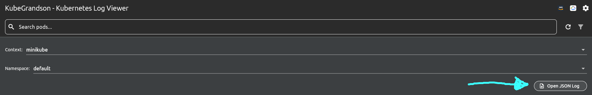
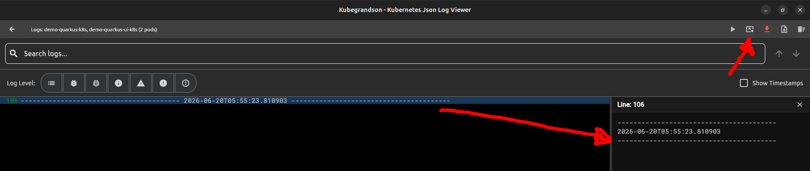
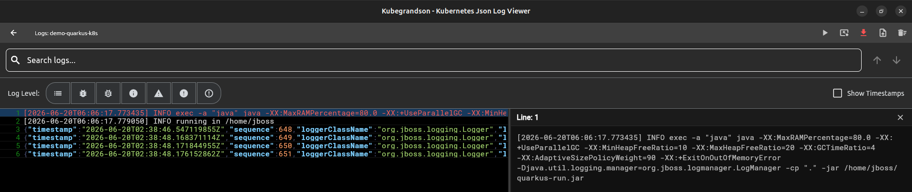
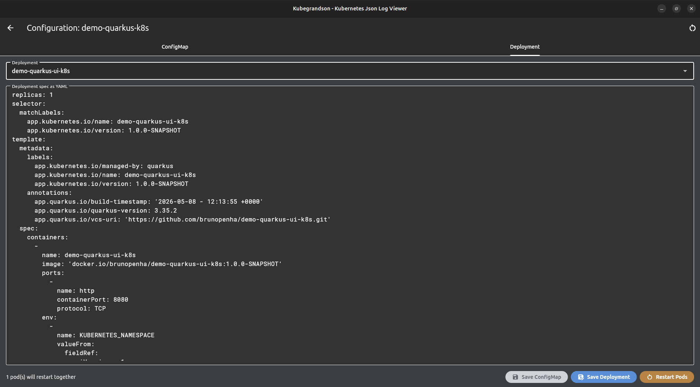
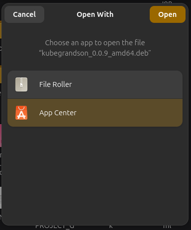

# Kubegrandson


Kubegrandson is a Flutter desktop app for Kubernetes troubleshooting and log analysis.

## Beta status

This is a beta version tested for:

- Ubuntu Linux (Debian-based)
- Windows 11 (also works on Windows 10 for installer flow)

## Main changes in this beta

### 1) Offline JSON log import

You can import an external JSON log file and inspect it offline.



### 2) Kubernetes context switch (minikube / AWS EKS / GCP GKE)

You can switch Kubernetes context from the UI. For AWS EKS and GCP GKE,
local cloud CLI access must already be available.


When using EKS, make sure the selected kubeconfig file points to the right `.kube/config`.


### 3) Add troubleshooting markers in the log

You can add log markers without clearing the current log stream.



### 4) Non-JSON log rendering

Logs that are not JSON are still supported and visualized correctly.



### 5) Deployment and ConfigMap inspection/editing

You can open and edit Deployment and ConfigMap data related to selected pods.



### 6) Cloud auth flow improvements

- Dedicated AWS settings section for profile, region, cluster, account, and SSO metadata
- Explicit AWS unauthorized guidance in the UI
- Retry flow for expired EKS credentials
- GCP GKE kubeconfig refresh from the UI using `gcloud`

Legacy 401 view (before the updated guidance):

## Kubernetes and cloud configuration

In **Settings**, configure:

- `Kubeconfig File` (used by the app for initialization and context switching)

For AWS EKS, use the **AWS Credentials** action in the home toolbar. Provide
profile, region, cluster name, and optional account/SSO metadata. The app runs:

```bash
aws sso login --profile <profile>
aws eks update-kubeconfig --region <region> --name <cluster> --profile <profile>
```

For GCP GKE, use the **GCP Credentials** action in the home toolbar. Provide
project ID, location, location type (`zone` or `region`), cluster name, and
optionally the GCP account. The app checks for an active `gcloud` account,
opens login when needed, sets the active project, then updates the kubeconfig:

```bash
gcloud auth list --filter=status:ACTIVE --format="value(account)"
gcloud auth login
gcloud config set project <project-id>
gcloud container clusters get-credentials <cluster> --zone <zone> --project <project-id>
# or, for regional clusters:
gcloud container clusters get-credentials <cluster> --region <region> --project <project-id>
```

After updating kubeconfig, the app switches to the generated context when it is
present, for example `gke_<project-id>_<location>_<cluster>`.

Security note:

- Do not store or share raw temporary AWS access key/secret/session token values in docs or screenshots.
- Do not store or share raw GCP access tokens or service account keys in docs or screenshots.
- Use profile/account-based login where possible.

## Installation

### Ubuntu (Debian-based)

Install with package manager (UI):



Install from terminal:

```bash
sudo apt install ./kubegrandson_0.8.0_amd64.deb
```

Uninstall:

```bash
sudo apt remove kubegrandson
```

### Windows

Run `kubegrandson_setup.exe` to install on Windows 10/11.

Windows SmartScreen can show a warning for unsigned internal builds:

- Click `More info`
- Click `Run anyway`

Uninstall options:

1. Settings -> Apps -> Installed apps -> Kubegrandson -> Uninstall
2. Control Panel -> Programs -> Uninstall a program -> Kubegrandson
3. Start Menu -> Kubegrandson -> Uninstall Kubegrandson

During uninstall, if asked about user data:

| Choice | Result |
| --- | --- |
| No (default) | Removes binaries only, keeps user data under `%LOCALAPPDATA%` / `%APPDATA%` |
| Yes | Removes binaries and user data folders |

## Development

```bash
flutter pub get
flutter run -d windows
```

or

```bash
flutter run -d linux
```

## Building a Linux release

Linux release artifacts are generated by `scripts/create_releases.sh`. The
script builds from a Git tag in an isolated worktree, so commit the release
changes and create the tag before running it:

```bash
git tag v0.8.0
RELEASE_TAG=v0.8.0 TARGETS=linux scripts/create_releases.sh
```

Generated files are written to:

```text
build/releases/v0.8.0/kubegrandson_0.8.0_amd64_linux.tar.gz
build/releases/v0.8.0/kubegrandson_0.8.0_amd64.deb
```

The `.deb` file is generated when `dpkg-deb` is installed. To create the
GitHub release and upload its assets as well, first authenticate with
`gh auth login`, then run:

```bash
RELEASE_TAG=v0.8.0 TARGETS=linux \
  PUSH_TAGS=1 CREATE_RELEASES=1 UPLOAD_ASSETS=1 \
  scripts/create_releases.sh
```

Review the tag and release notes before enabling the publishing flags. Running
the script without them only builds local artifacts.
