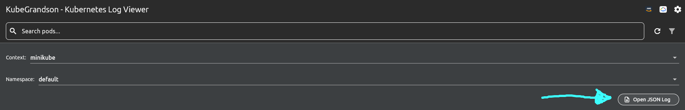
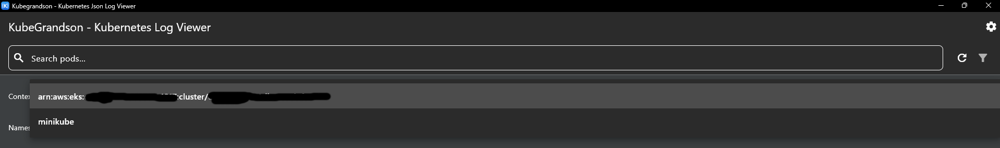
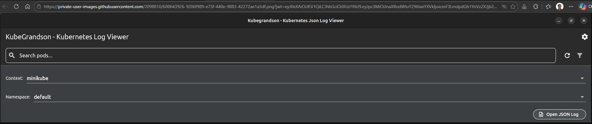
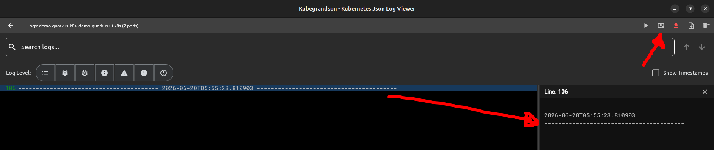
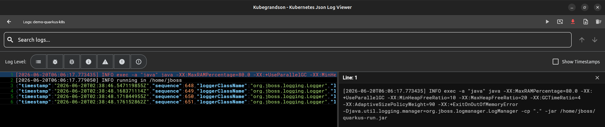
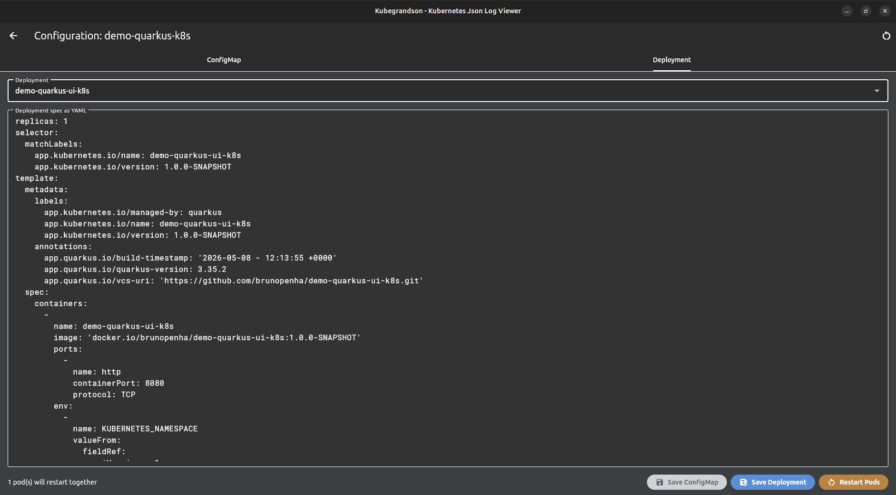
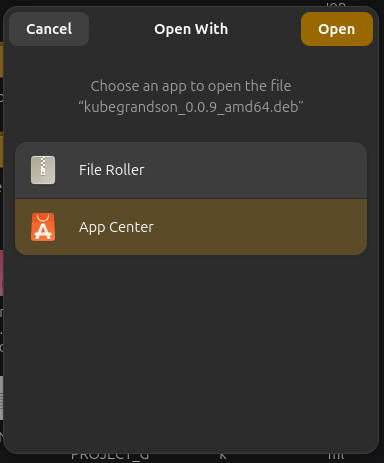

# Kubegrandson


Kubegrandson is a Flutter desktop app for Kubernetes troubleshooting and log analysis.

## Beta status

This is a beta version tested for:

- Ubuntu Linux (Debian-based)
- Windows 11 (also works on Windows 10 for installer flow)

## Main changes in this beta

### Offline mock microservices and XML analyzer

The **Mock microservices** screen runs one or more lightweight HTTP servers
using Dart only. Each service can define its port, method, path, response
headers/body/status and a log message. Received headers and bodies are visible
inside Kubegrandson without a Kubernetes connection. Configurations can be
exported to and imported from JSON.

The **JSON and XML analyzer**, available from the top-right toolbar, provides a
large editor for pasted content and opens files according to the selected
format. It validates JSON or XML, reports the error line and column, and shows
every field/tag value. For XML it also counts tags and groups repeated direct
child tags by their parent path. Mock-server request details provide the same
structured field/value view for received JSON and XML bodies.

Mock services can also run with HTTPS by enabling TLS and selecting a PEM
certificate chain and private key. The **HTTPS instructions** action explains
self-signed certificate generation, client trust, form-encoded OAuth requests,
and local IP routing limitations. Keep real client secrets out of exported
configuration files.

#### Creating a self-signed certificate for an HTTPS mock

OpenSSL must be installed and available in the terminal. On Ubuntu/Debian:

```bash
sudo apt install openssl
```

Use `mock.bruno.penha.nom.br` as the readable local name for the simulator.
Map it to the loopback address before starting the client.

On Linux/macOS, add this line to `/etc/hosts`:

```text
127.0.0.1 mock.bruno.penha.nom.br
```

On Windows, add the same line as Administrator to:

```text
C:\Windows\System32\drivers\etc\hosts
```

Then generate a certificate for the subdomain:

```bash
openssl req -x509 -newkey rsa:2048 -sha256 -nodes -days 365 \
  -keyout mock-key.pem \
  -out mock-cert.pem \
  -subj "/CN=mock.bruno.penha.nom.br" \
  -addext "subjectAltName=DNS:mock.bruno.penha.nom.br,IP:127.0.0.1"
```

To serve using another local IP, include that IP in `subjectAltName`. For
example, for `mocked.bruno.penha.nom.br`:

```bash
openssl req -x509 -newkey rsa:2048 -sha256 -nodes -days 365 \
  -keyout mock-key.pem \
  -out mock-cert.pem \
  -subj "/CN=192.168.99.100" \
  -addext "subjectAltName=IP:192.168.99.100,DNS:mock.bruno.penha.nom.br"
```

This creates:

- `mock-cert.pem`: certificate chain selected in Kubegrandson.
- `mock-key.pem`: private key selected in Kubegrandson.

In **Mock microservices**, create the service, enable **Serve with HTTPS**, and
select both files. For an OAuth token mock, one possible configuration is:

```text
Method: POST
Port: 1313
Path: /auth/realms/bruno/protocol/openid-connect/token
```

Test it from a terminal:

```bash
curl --insecure --request POST \
  --header "content-type: application/x-www-form-urlencoded" \
  --data "client_id=example-client&grant_type=client_credentials&client_secret=REPLACE_ME&scope=example.write" \
  https://mock.bruno.penha.nom.br:1313/auth/realms/bruno/protocol/openid-connect/token
```

`--insecure` is appropriate only for a temporary development test. Prefer
adding `mock-cert.pem` to the test client's trust store. The configured IP must
belong to, or be routed to, the computer running Kubegrandson. Do not commit or
share `mock-key.pem`, real client secrets, or exported configurations containing
secrets.

Dynamic route segments are supported with `:name` or `{name}`. For example,
configure `/api/v1/credentialRequests/:id` to match requests ending in any
credential number. Captured parameter values are shown in **Received
requests**, where the complete request can also be selected or copied.

Query parameters can use the same syntax. For example,
`/orders?pageSize=25&product=:productId&status=:statusId` validates literal
values, captures dynamic values, and matches regardless of query parameter
order. Extra query parameters are accepted.

The endpoint form includes a **Generate JSON** action with presets compatible
with JMeter extractors such as `$.data[*].orderId` and
`$.batches[*].batch_id`, plus a custom simple array JSONPath option. Values are
entered one per line and the JSON content type is configured automatically.

Multiple endpoints can share the same mock server, protocol, and port. Use the
**Add endpoint on this server** action next to an existing service; requests are
routed by HTTP method and path without opening a second socket.

Server settings and endpoint settings are edited separately. Protocol, port,
certificate chain, and private key belong to the server and are inherited by
all its endpoints. Method, path, simulated response, status, and log message
belong to each endpoint. Changing the shared server settings updates every
endpoint, so certificates do not need to be selected repeatedly.

### 1) Offline JSON log import

You can import an external JSON log file and inspect it offline.



### 2) Kubernetes context switch (minikube / AWS EKS / GCP GKE)

You can switch Kubernetes context from the UI. For AWS EKS and GCP GKE,
local cloud CLI access must already be available.



When using EKS, make sure the selected kubeconfig file points to the right `.kube/config`.



### 3) Add troubleshooting markers in the log

You can add log markers without clearing the current log stream.



### 4) Non-JSON log rendering

Logs that are not JSON are still supported and visualized correctly.



### 5) Deployment and ConfigMap inspection/editing

You can open and edit Deployment and ConfigMap data related to selected pods.



### 6) Cloud auth flow improvements

- Dedicated AWS settings section for profile, region, cluster, account, and SSO metadata
- Explicit AWS unauthorized guidance in the UI
- Retry flow for expired EKS credentials
- GCP GKE kubeconfig refresh from the UI using `gcloud`

Legacy 401 view (before the updated guidance):

## Kubernetes and cloud configuration

In **Settings**, configure:

- `Kubeconfig File` (used by the app for initialization and context switching)

For AWS EKS, use the **AWS Credentials** action in the home toolbar. Provide
profile, region, cluster name, and optional account/SSO metadata. The app runs:

```bash
aws sso login --profile <profile>
aws eks update-kubeconfig --region <region> --name <cluster> --profile <profile>
```

For GCP GKE, use the **GCP Credentials** action in the home toolbar. Provide
project ID, location, location type (`zone` or `region`), cluster name, and
optionally the GCP account. The app checks for an active `gcloud` account,
opens login when needed, sets the active project, then updates the kubeconfig:

```bash
gcloud auth list --filter=status:ACTIVE --format="value(account)"
gcloud auth login
gcloud config set project <project-id>
gcloud container clusters get-credentials <cluster> --zone <zone> --project <project-id>
# or, for regional clusters:
gcloud container clusters get-credentials <cluster> --region <region> --project <project-id>
```

After updating kubeconfig, the app switches to the generated context when it is
present, for example `gke_<project-id>_<location>_<cluster>`.

Security note:

- Do not store or share raw temporary AWS access key/secret/session token values in docs or screenshots.
- Do not store or share raw GCP access tokens or service account keys in docs or screenshots.
- Use profile/account-based login where possible.

## Installation

### Ubuntu (Debian-based)

Install with package manager (UI):



Install from terminal:

```bash
sudo apt install ./kubegrandson_0.8.0_amd64.deb
```

Uninstall:

```bash
sudo apt remove kubegrandson
```

### Windows

Run `kubegrandson_setup.exe` to install on Windows 10/11.

Windows SmartScreen can show a warning for unsigned internal builds:

- Click `More info`
- Click `Run anyway`

Uninstall options:

1. Settings -> Apps -> Installed apps -> Kubegrandson -> Uninstall
2. Control Panel -> Programs -> Uninstall a program -> Kubegrandson
3. Start Menu -> Kubegrandson -> Uninstall Kubegrandson

During uninstall, if asked about user data:

| Choice | Result |
| --- | --- |
| No (default) | Removes binaries only, keeps user data under `%LOCALAPPDATA%` / `%APPDATA%` |
| Yes | Removes binaries and user data folders |

## Development

```bash
flutter pub get
flutter run -d windows
```

or

```bash
flutter run -d linux
```

## Building a Linux release

Linux release artifacts are generated by `scripts/create_releases.sh`. The
script builds from a Git tag in an isolated worktree, so commit the release
changes and create the tag before running it:

```bash
git tag v0.8.0
RELEASE_TAG=v0.8.0 TARGETS=linux scripts/create_releases.sh
```

Generated files are written to:

```text
build/releases/v0.8.0/kubegrandson_0.8.0_amd64_linux.tar.gz
build/releases/v0.8.0/kubegrandson_0.8.0_amd64.deb
```

The `.deb` file is generated when `dpkg-deb` is installed. To create the
GitHub release and upload its assets as well, first authenticate with
`gh auth login`, then run:

```bash
RELEASE_TAG=v0.8.0 TARGETS=linux \
  PUSH_TAGS=1 CREATE_RELEASES=1 UPLOAD_ASSETS=1 \
  scripts/create_releases.sh
```

Review the tag and release notes before enabling the publishing flags. Running
the script without them only builds local artifacts.
